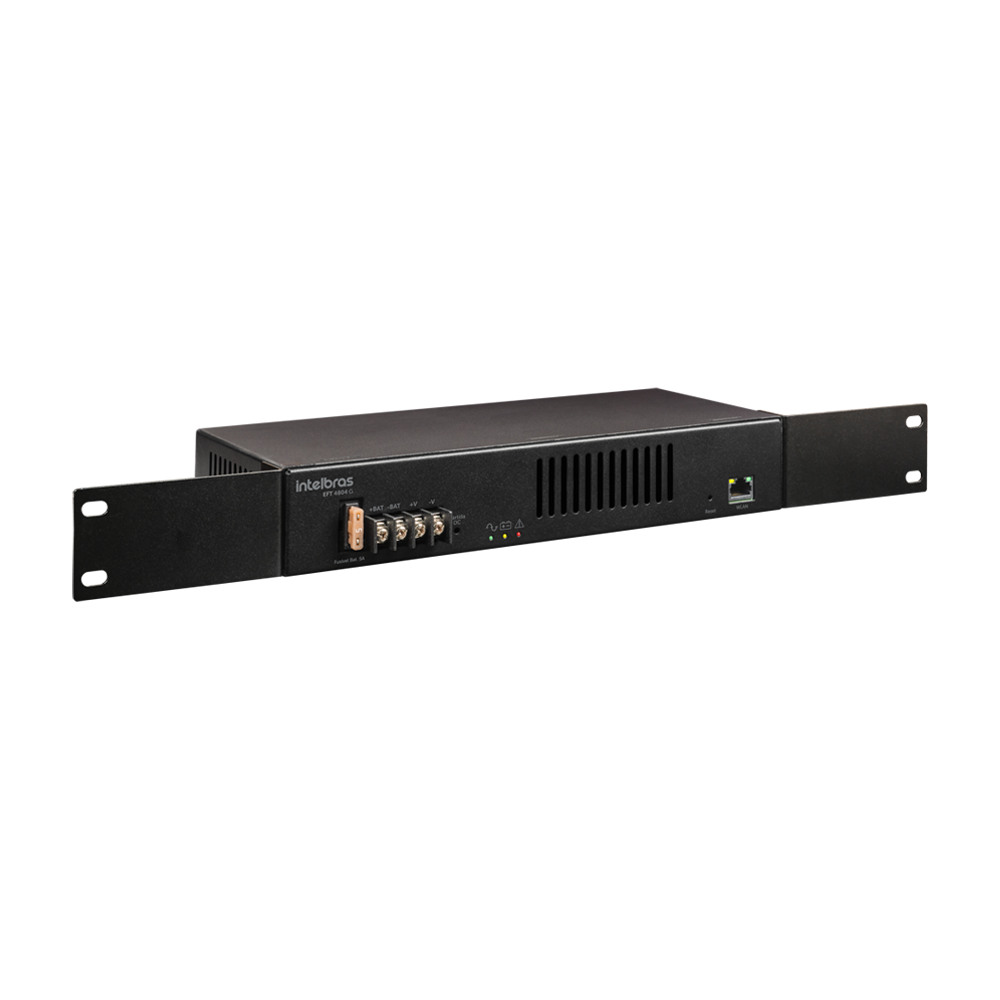
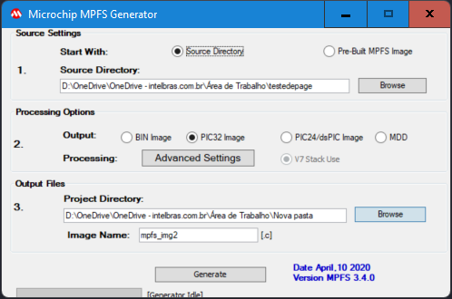
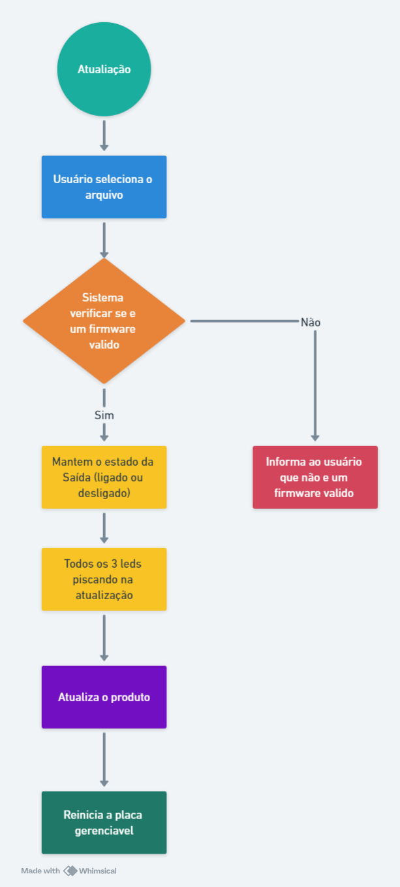

# FONTE GERENCIÁVEL

## Introdução

Este é um projeto de uma fonte de energia de 48 volts 4 amperes, sua principal funcionalidade e forncerce energia mesmo durante uma falha de forncecimento da rede eletrica por meio de banco de baterias.
Seu principal aplicação de cenario e no ambiente de telecomunicação fornecendo energia para OLTs e demais dispositivos.

<div align ="center" style = "margin: -100px 100px -100px 100px">
  
</div>


### Funcionalidades do produto

- Funcionalidade UPS,
- Gerenciamento remoto,
- Comunicação pelo protocolo SNMP,
- Pagina web para configuração

### Fluxo Basico do Produto
A placa de potência da fonte se comunica por meio de protocolo I2C onde ela recebe comandos da placa gerenciavel que solicita informações como:
- Tensão da rede eletrica,
- Tensão da Bateria,
- Tensão e corrente da saída,
- Envia comando para habilitar fornecimento de energia na saida da fonte.

<br/>
<div align="center">
  
</div>
<br/>
E este dados e comandos são repasado para a camada do protocolo SNMP e Pagina HTTP onde o usuario podem oberserva-los e executar ação de comando no produto. 

### Divisão do projeto

Este projeto se divide em 3 partes: <br>
* Firmware da placa da fonte de potencia;
* Firmware da placa de gerenciamento
* Pagina de configuração da fonte.

## Detalhamento

### 1- Firmware

Os firmware foram desenvolvidos utilizado o MPLAB da Microchipe na versão v.6.00. ( *pode ser utilizar qualquer versão acima dessa para continuar o desenvolvimento.* )
<br/>
Para o firmware da placa gerenciavel foi utilizdo o framework **[Harmony V3](https://www.microchip.com/en-us/tools-resources/configure/mplab-harmony#)**  
Todas as lib utilizadas pode ser baixadas diretamente no gerenciador de biblioteca do Harmony V3 no MPLAB.

### 2- Pagina WEB

A pagina de configuração é embarcada no chip **ATSAME53N20A** da placa de gerenciamento.
Todos os arquivos necessitam esta no mesmo nivel de pasta (arquivos em subpasta não são carregados),
os arquivos **.html** devem ser salvos em **.htm** e para poder embarca as paginas os arquivo precisão passar por um programa de compressão e este programa que fica dentro da pasta de biblioteca no seguinte caminha *\harmony\net\utilities\mpfs_generator* arquivo **mpfs2.jar**

<br/>
<div align="center">
  
</div>
<br/>

O primeiro passo e localizar o caminho da pasta que contem os aquivos htm,css, javascript, imagens.Verificar se todas as esteções dos arquivos que deseja gera a imagem estão adicionada na opção Advanced Settings onde é possivel configurar quais tipos de arquivos deve ser convertidos na geração da imagem que será embarcada no firmware.
Depois selecione o local para salvar a imagem e clique em **Generate**.

<br/>

### Status do Desenvolvimento

1- **Firmware da placa de fonte de potencia.**<br/>
&nbsp; &nbsp; Firmware 98% ja desenvolvido falta implementa:
- Comunicação I2C (escravo) para enviar os dados necessarios para a placa de gerenciamento. <br>

&nbsp; &nbsp; *Obs: Comunicação I2C ja foi validada.*


2- **Firmware da placa de gerenciamento**<br/>
&nbsp; 30% desenvolvido desenvolvido falta implementar: <br/>
 - Comunicação I2C(Mestre) para receber os dados da placa de potencia da fonte e enviar comandos.<br>
 - Comunicação SNMP V3,
 - WatchDog,
 - Atualização Remota, 
 - Integração dos dados capturados pelo firmware da placa gerenciavel na pagina de configuração WEB.

3- **Pagina de configuração da fonte** <br/>
Temos todas as telas que necessitamos ja desenvolvidas falta realizar ajuste como:
- resposividade para possibilitar o acesso e utilização por dispositivo moveis.
- Integração dos dados enviado pelo processamento da placa de gerenciamento.
- Implentação da senha de acesso mais segura.

## Teste da pagina web

Para visualizar todo o funcionamento da pagina web e necessario instalar um plugin Live Serve no Vscode e abrir o aquivo index.htm com live server.
<br/>
<div align="center">
  
</div>
<br/>

A senha de acesso hoje estão de forma estaticas no arquivo authorization.js
```
var authUsername = "intelbras";
var authPassword = "admin123"; 
```

## Variaveis a serem monitoradas

 - Temperatura (dado vindo do chip da placa gerenciavel),
 - Tensão da Saida da fonte (0 - 55 volts),
 - Corrente da Saída da fonte (0 - 3.5A),
 - Tensão da Bateria (0 - 55 volts),
 - Corrente de carregamento(0-1A),
 - Status da Saída (on / off),
 - Modo de operação AC( quando tem tensão da rede eletrica) - DC( energia fornecida pela bateria),
 - Contabilizar as quedas de energia da rede eletrica ultimos 15 dias (sera sinalizado apenas uma flag na pagina de configuração),
 - Status de carregamento (Carregando / Carregada)


## Fluxograma de sequencia para watchDog

<br/>
<div align="center">
  
</div>
<br/>

## Fluxograma de sequencia para atualização

A atualização desse produto nesse primeiro momento o usuario deve baixa o arquivo e carrega-lo atraves da pagina de configuração do produto.

<br/>
<div align="center">
  
</div>
<br/>

